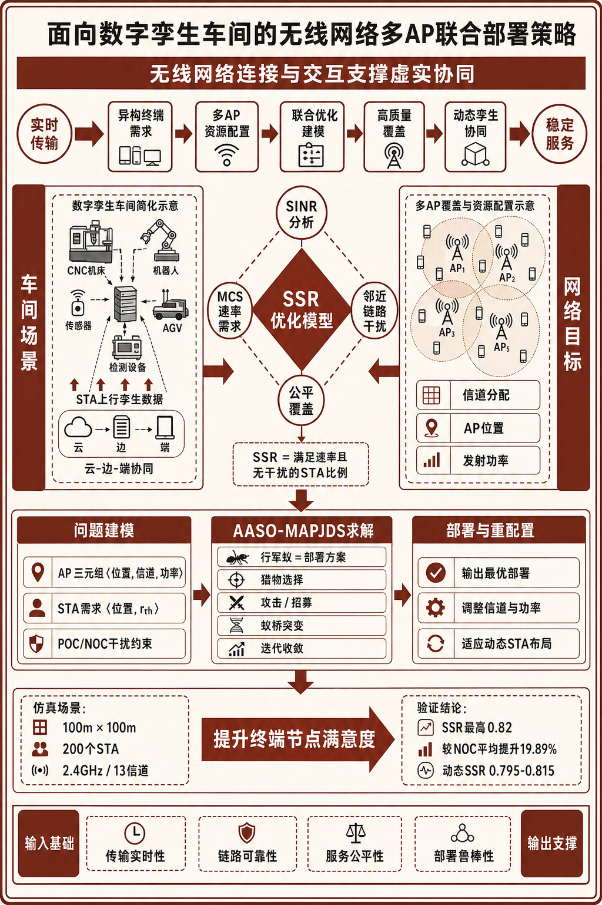
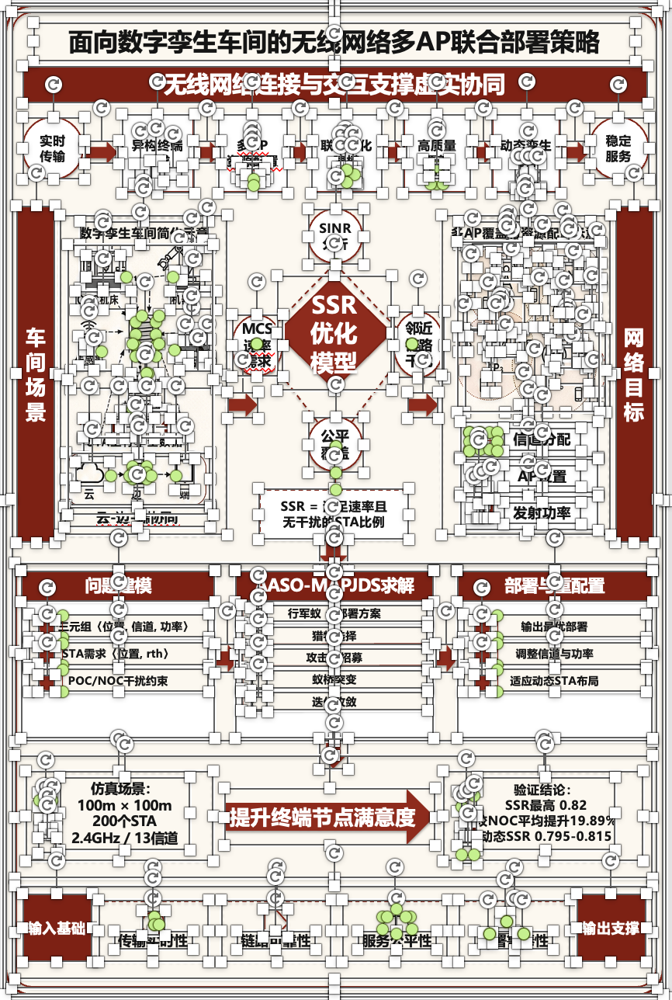
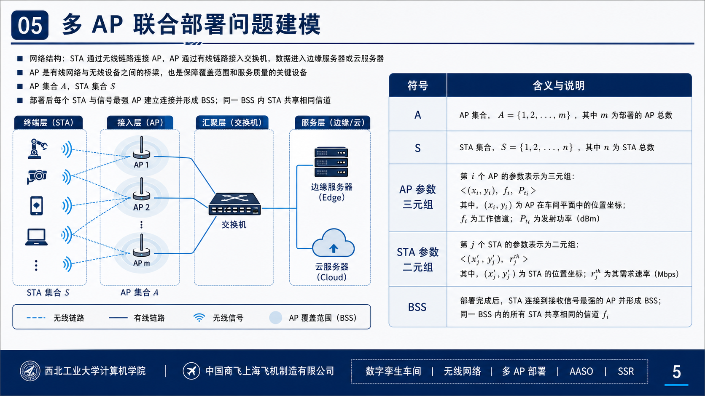
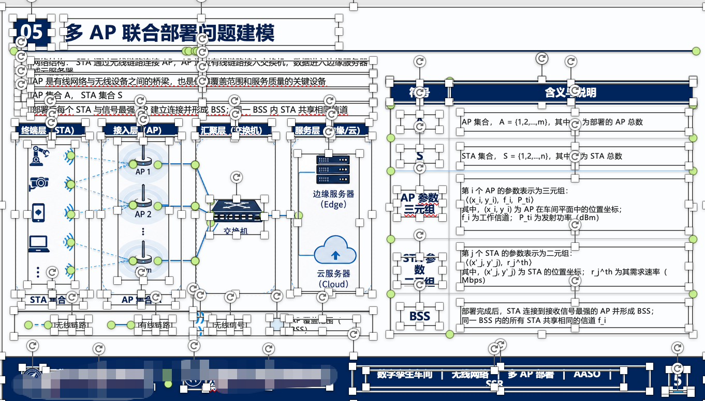

# XiaoBei Skill: Image to VBA

大家好，我是**小北在读研**，研二在读，电子信息专业。目前主要做 **AI + 科研**、**Agent 赋能科研工作流** 相关内容。全网10w➕粉丝，感兴趣的朋友也可以关注一下我的抖音：小北在读研

长期分享科研工具、论文阅读、学术绘图、科研 Agent、AI 自动化和研究生提效方法。除了这个开源 skill，我还在维护个人学术网站 [xiaobeiai.top](https://xiaobeiai.top) 和科研 API 中转站 [beiapi.cn](https://beiapi.cn)。

这个仓库整理的是我自用并持续迭代的 **XiaoBei Skill: Image to VBA**，目标是将 PNG/JPG 图片中的学术图、科研示意图、幻灯片截图或 UI 截图，转化为 PowerPoint / Office 里可以继续编辑的 Shapes 和 VBA 代码。

它不是把原图再生成一张静态图片，而是尽量把图中的结构、文字、线条、箭头、标注和局部裁剪资产，重建为可以在 PowerPoint、Excel 或 Word 里二次修改的 Office 对象与 VBA 宏。


## 加入科研 AI 交流

如果你是硕士、博士、科研工作者，或者正在做论文、课题、学术绘图、科研自动化、Agent 工作流，欢迎加我微信交流。

<table>
  <tr>
    <td width="46%" valign="top">
      <h3>和小北一起做 AI + 科研</h3>
      <p>适合硕博生、科研工作者、论文写作者、科研工具爱好者。</p>
      <p>交流方向：科研 Agent / 学术绘图 / 论文工作流 / API 工具 / 研究生提效。</p>
      <p><strong>加好友建议备注：</strong><br><code>GitHub + 学校/方向 + 年级</code></p>
      <p>例如：<code>GitHub + 电子信息 + 研二</code></p>
    </td>
    <td width="54%" align="center" valign="middle">
      
    </td>
  </tr>
</table>

你也可以通过这些入口了解我正在做的东西：

- 个人学术网站：[xiaobeiai.top](https://xiaobeiai.top)
- 科研 API 中转站：[beiapi.cn](https://beiapi.cn)
- 内容方向：AI + 科研、Agent 赋能科研、研究生提效、学术绘图、论文工作流

## 项目亮点

- **可编辑优先**：文字、箭头、框、表格、图例、坐标轴等优先用 Office Shapes 重建。
- **Hybrid 保真**：显微图、照片、复杂 3D 渲染、logo 等不适合硬拆的区域，会作为小范围 raster crop 保留，并在报告里明确标注。
- **Manifest 驱动**：先列元素清单，再建坐标模型，降低漏元素、错位、箭头乱指的问题。
- **Render-verify 闭环**：可用本地 Office 时，导出渲染图并与原图做差异比对。
- **WPS 兼容意识**：没有假设 WPS 一定能自动导入/运行宏，会给出手动 fallback。

## 效果展示

下面的“可编辑还原效果”截图里能看到 PowerPoint/WPS 类编辑锚点，用来展示图形已经被重建成可编辑对象，而不是只贴了一张静态截图。

### 案例 1：科研技术路线图 / 机制图复刻

| 输入原图 | 可编辑还原效果 |
|---|---|
|  |  |

### 案例 2：学术 PPT 页面结构重建

| 输入原图 | 可编辑还原效果 |
|---|---|
|  |  |

## 仓库结构

```text
xiaobei-skill-image-to-vba/
├── assets/
│   ├── contact/
│   └── gallery/
├── skills/
│   └── xiaobei-skill-image-to-vba/
│       ├── SKILL.md
│       ├── agents/openai.yaml
│       ├── assets/
│       ├── references/
│       └── scripts/
├── README.md
├── LICENSE
├── NOTICE
├── requirements.txt
├── CONTRIBUTING.md
├── SECURITY.md
└── CITATION.cff
```

## 安装到 Codex

把 skill 文件夹复制或软链接到你的 Codex skills 目录：

```bash
mkdir -p ~/.codex/skills
ln -s "$(pwd)/skills/xiaobei-skill-image-to-vba" ~/.codex/skills/xiaobei-skill-image-to-vba
```

之后在 Codex 中可以这样调用：

```text
Use $xiaobei-skill-image-to-vba to convert this uploaded academic image into editable Office VBA Shapes code.
```

## 脚本依赖

Python 脚本主要用于环境检测、坐标换算、裁剪保留元素、VBA 轻量检查和图像比对。

```bash
python -m venv .venv
source .venv/bin/activate
python -m pip install -r requirements.txt
```

## 常用脚本

```bash
python skills/xiaobei-skill-image-to-vba/scripts/detect_office_environment.py
python skills/xiaobei-skill-image-to-vba/scripts/coordinate_helper.py 1600 900 960 540
python skills/xiaobei-skill-image-to-vba/scripts/vba_lint.py path/to/generated.bas
python skills/xiaobei-skill-image-to-vba/scripts/compare_images.py source.png rendered.png --pretty
```

macOS PowerPoint 自动化尝试：

```bash
python skills/xiaobei-skill-image-to-vba/scripts/run_powerpoint_vba_macos.py path/to/generated.bas
```

Windows PowerPoint COM 自动化尝试：

```powershell
powershell -ExecutionPolicy Bypass -File skills/xiaobei-skill-image-to-vba/scripts/run_powerpoint_vba_windows.ps1 -VbaFile path\to\generated.bas
```

## 安全提醒

这个项目会生成或辅助运行 VBA 宏。请只运行你信任的 VBA 代码，运行前先阅读生成的 `.bas` 文件。Office 可能会拦截宏导入或要求开启“信任对 VBA 项目对象模型的访问”，这是正常的安全边界。

## 图片与版权

Hybrid 模式可能会裁剪用户提供图片中的局部元素，例如显微图、logo、论文插图或截图。使用者应确保自己拥有输入图片及生成素材的使用权。示例素材请优先使用自绘、公版或已授权图片。

## 开源与署名

本仓库使用 Apache-2.0 license。代码和文档可以在许可证范围内使用、修改和分发，但“小北在读研”“小北”“XiaoBei”等个人品牌标识不授权用于暗示作者背书、赞助或官方关联。

开源不能完全阻止别人 fork 或二次分发。这个仓库通过明确命名、`NOTICE`、`CITATION.cff` 和品牌说明，尽量把来源和记忆点钉牢。

## 非官方声明

本项目与 Microsoft、WPS、OpenAI 或 Codex 官方没有从属、赞助或背书关系。PowerPoint、Office、WPS、OpenAI、Codex 等名称属于各自权利人。
